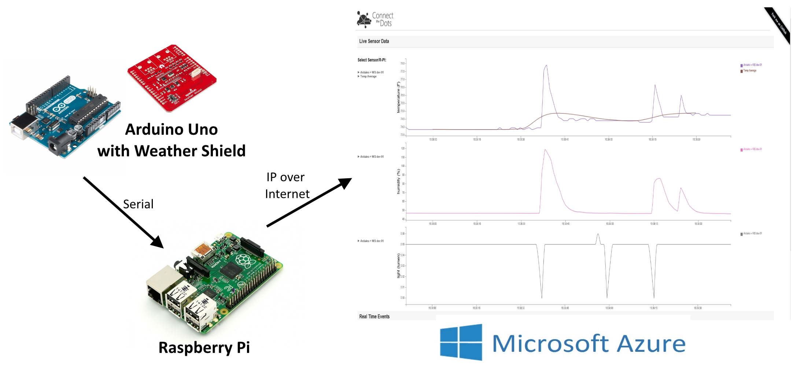
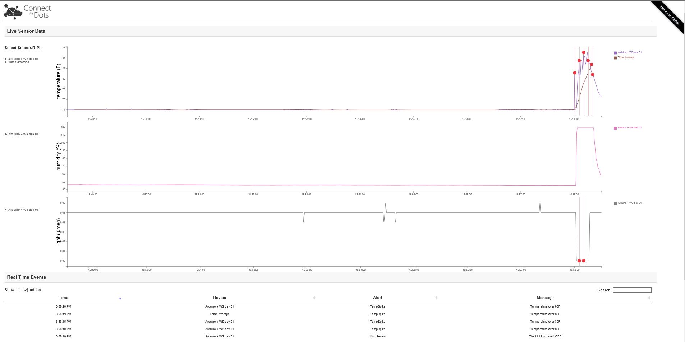

# Getting Started #
As good first task we'll walk you through building a simple sensor sensing network. It can be built quickly and easily with minimal knowledge of programming or Microsoft Azure, using commodity devices available locally or online - for example an Arduino based board with sensors connected, connected to a Raspberry Pi sending data to an Azure website. 

Sample code for this is included in the project.

## Hardware prerequisites for Connect The Dots getting started project ##
If you are going to deploy the starter solution, you need to procure an Arduino UNO and Raspberry Pi, as shown in the documentation for those devices in the appropriate folders:

- [Arduino Based Board and Sensors](https://github.com/tanchunsiong/Custom-Connect-The-Dots---Public/tree/master/connectthedots%20arduino%20sketch)
- [Raspberry Pi](https://github.com/tanchunsiong/Custom-Connect-The-Dots---Public/tree/master/connectthedotsservice%20RPi2%20headed%20app%20-%20GPIO)

## Software prerequisites ##
In order to reproduce one of the ConnectTheDots.io scenarios, you will need the following:

Common Stack

	1. Microsoft Azure subscription ([free trial subscription](http://azure.microsoft.com/en-us/pricing/free-trial/) is sufficient)
	2. Python 2.7.x for your CPU Architecture [Windows x86 and x64](https://www.python.org/downloads/) or [MacOS] (https://www.python.org/downloads/mac-osx/)
		a. Do remember to set your environment variable for your installed folder containing Python.exe 
	3. Node 0.10.40 [Windows x64](https://nodejs.org/dist/v0.10.40/x64/node-v0.10.40-x64.msi) or [MacOS] (https://nodejs.org/dist/v0.10.40/node-v0.10.40.pkg)
		a. a. Do remember to set your environment variable for your installed folder containing node.exe 
	4. Visual Studio Code https://code.visualstudio.com/

Microsoft Specific Stack 

	1. Visual Studio 2015 Recommended – [Community Edition](http://www.visualstudio.com/downloads/download-visual-studio-vs) is sufficient
	2. Node JS Tools for Visual Studio 2015 https://www.visualstudio.com/en-us/features/node-js-vs.aspx
	3. Azure SDK for Visual Studio [Select the latest version here](http://azure.microsoft.com/en-us/downloads/)
	4. Python Tools for Visual Studio https://www.visualstudio.com/en-us/features/python-vs.aspx

## Setup Tasks ##
Setting up your IoT solution involves several distinct steps, each of which is fully described in this project:

	1. Clone or copy the project to your machine (NOTE: place the project in a folder as close to the root of your file system as possible. Some paths in the project are very long and you might encounter issues with long path names when restoring NuGet packages, or NPM Packages)
	2. [Azure prep](Azure/AzurePrep/AzurePrep.md) - Creating basic Azure resources
	3. [Device setup](https://github.com/tanchunsiong/Custom-Connect-The-Dots---Public/tree/master/connectthedots%20arduino%20sketch) - Configuring your device(s)
	4. [Sample website deployment](https://github.com/tanchunsiong/Custom-Connect-The-Dots---Public/tree/master/connectthedots%20nodejs%20website%20with%20highcharts) - Publishing a generic sample website for viewing the data
	5. [Stream Analytics integration](StreamAnalyticsQueries/SA_setup.md) - Configuring Stream Analytics to send alerts and averages to the sample website.
  
To get started with our simple example, complete the tasks above in order. Navigation is provided on each page to get to the next topic.

## Run the scenario ##

Once you have setup the services, published the site, provisioned and connected your devices, you will see data coming up on your website at the URL you chose when deploying the site.

You should see average sensor measurements showing up in the web browser every few seconds.

If you select “All”, you should see raw readings from the device coming in every second.
If the sensor value you have set in stream analytics exceeds your specified threshold value, you should see an alert showing in the alerts table
If you cover the light sensor (if present), you will see an alert telling you the light is turned off.

