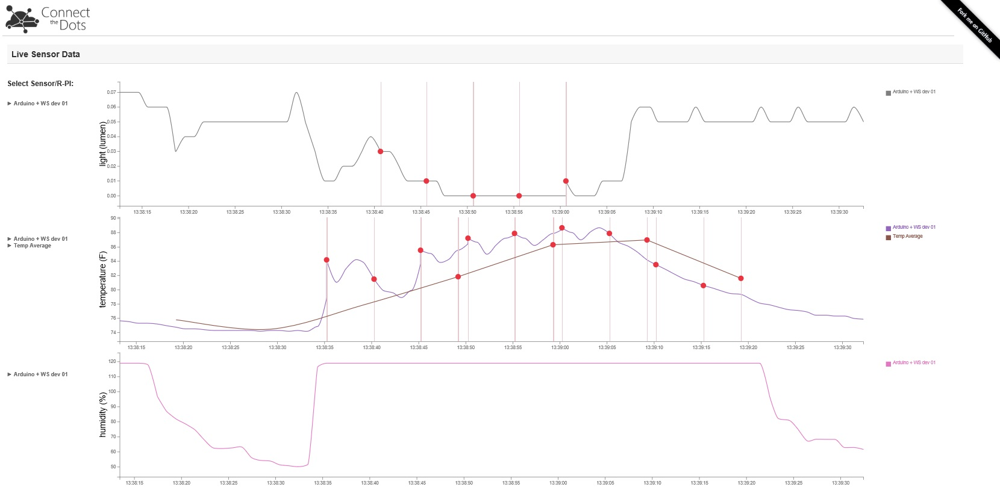
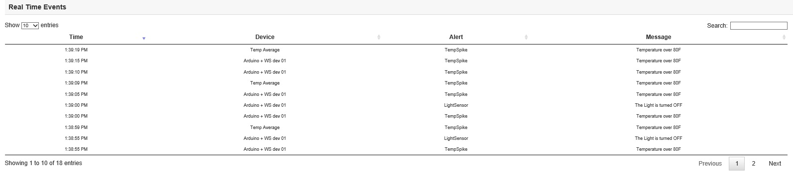

# Website details #

This implementation is based on NodeJS 0.10.40.
First assuming all dependencies has already been installed on your PC / Mac, you would now need to nagivate to the folder directory of this project in either command prompt on Windows or prefered shell on Mac

1. Resolve all dependencies by typing "npm install"
2. Extract sbus-amqp10.zip into node_modules directory

To test out the application locally, while still in the same folder directory, type in "node index.js", and open up http://localhost:8080/default.html or http://localhost:8080/highcharts.html 

If you would like to change the port, ensure no services are already using the port, and change the value in index.js from 
	"var port = process.env.PORT || 8080;" 
to 
	"var port = process.env.PORT || 80;"

Once you have your website running, you'll notice more is being displayed on the charts than just the raw data.  Here you'll learn about the features of the website that weren't discussed during setup.
If there is no data, don't worry, you need to just start sending data from your IoT device.

#### Dots on the graph ####
You'll see dots showing up on the graph if you've set up alerts for that data stream.  In the getting started project, this was done with the light sensor data to register an alert whenever the light is off, as well as when the temperature rises above 80 degrees.  Hovering over that dot shows you the value during the alert, and what that alert is.

#### Secondary line on chart ####
If you have Stream Analytics set up, such as for temperature in our getting started project, you'll see a second line on your chart, along with an added entry in the legend of that chart.  If you click on that data stream name on the left, it will toggle the display of that data on the chart.

#### Hover over data streams ####
If you hover over the data stream on the left, you'll be presented with the location of the device.  In the case of the getting started project, you'll see both the public and local IP address of your gateway.

#### Alert table ####
Below the charts, you'll see a table listing all the real time alerts, including the message, time, which device, and what alert was fired.

