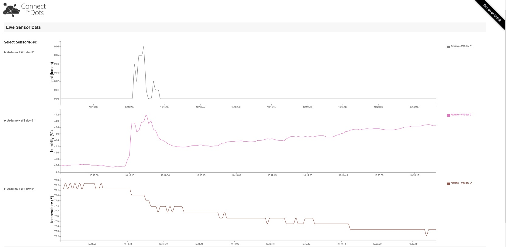

# Website Publish #
This document explains how to build and deploy a sample website that is used to show data and alerts in the Connect The Dots project. It assumes you have all necessary software and subscriptions and that you have cloned or download the ConnectTheDots.io project on your machine.

## Prerequisites ##

Make sure you have all software installed and necessary subscriptions as indicated in the Introduction.md file for the project. To repeat them here, you need

1. Microsoft Azure subscription ([free trial subscription](http://azure.microsoft.com/en-us/pricing/free-trial/) is sufficient)
1. Access to the [Azure Streaming Analytics Preview](https://account.windowsazure.com/PreviewFeatures)
1. Visual Studio – [Community Edition](http://www.visualstudio.com/downloads/download-visual-studio-vs)

## Configure Web.config and IISNode.yml
In order for the website publishing to work, you might need to edit some fields in the configuration files.

If you already have the event hubs and are simply republishing a website, you can just edit the `index.js` file manually before publishing. Open `index.js` and find the lines
The below are an existing public event hub which was created for the purpose of training and demonstration. When you are ready to publish your own website + websocket connections, replace the below values with your eventhub name and key.

var serviceBus = 'cspi1-ns',
    eventHubName = 'ehdevices',
    sasKeyName = 'WebSite', // A SAS Key Name for the Event Hub, with Receive privilege
    sasKey = 'pAgoae/7zJ+FSvyAVJObDZM0e73dwSrD5GpbiSxySFI=', // The key value
    consumerGroup = 'nodejsconsumergroup',
    numPartitions = 8;

## Publish the Azure Website ##

* Create a new Web Apps on [Azure webpage](https://manage.windowsazure.com) and select "From Gallery"
* Look for Node JS Starter Site template, and enter your prefered URL for your website.
* There are a few ways to deploy your web application. Setting up source control or FTP method will be relatively easy.
	* you might want to take the opportunity to update your /js/d3CTD.js and /js/highchartCTD.js with your new URL. 
	* search for "8080" and replace the existing websocket URL with your own URL. it will be in the format of ws://yourname.azurewebsites.net:8080

## Websockets setting ##
* Enable WebSockets for the new Azure Web site
    * Browse to https://manage.windowsazure.com and select your Azure Web Site.
    * Click on the Configure tab. Then set WebSockets to On and Click "Save"
	
##Running the site
* Open the site in a browser to verify it has deployed correctly. 
    * At the bottom of the page you should see “Connected.”. If you see “ERROR undefined” you likely didn’t enable WebSockets for the Azure Web Site (see above section) on updating your /js/d3CTD.js and /js/highchartCTD.js with your new URL. 

**Note** There is a chance you won't see any data coming into your site when you first stand it up.  If that is the case, try rebooting your gateway or restarting your azure website.

If you would like to run this on Windows VM, try this guide here http://reverentgeek.com/hosting-node-js-on-microsoft-azure/
If you are familiar with deploying NodeJS projects on Linux VM, feel free to explore the different Linux distro flavours available on Azure.

If you're following the getting started project, the next task is [Stream Analytics integration](../StreamAnalyticsQueries/SA_setup.md).
